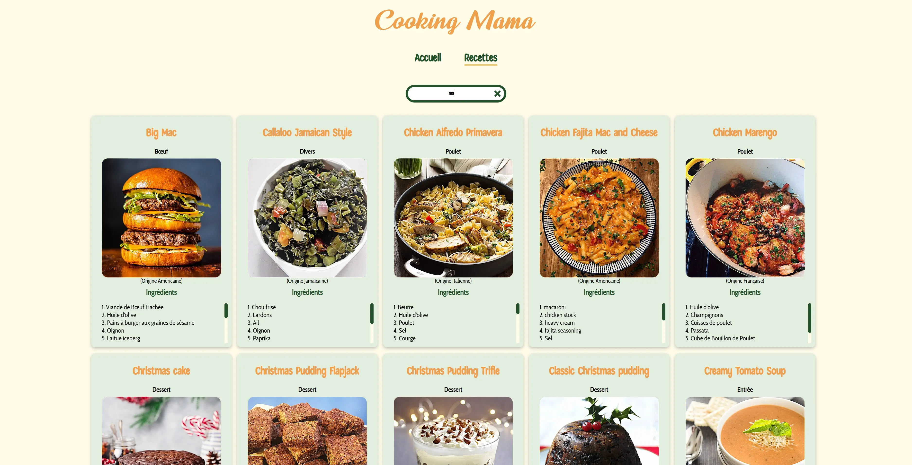

# Cooking Mama - Recipe Catalog Web App

Explore a variety of delicious recipes from around the world. Discover unique dishes and learn to cook like a chef. Get inspired for your meals with our diverse recipe catalog.

## Table of Contents

- [Description](#description)
- [Installation](#installation)
- [Usage](#usage)
- [Technologies Used](#technologies-used)
- [Contact](#contact)

## Description

Cooking Mama is a learning project : a web application developed using React that allows users to explore a wide range of recipes sourced from the MealDB API. Users can search for specific recipes, view detailed ingredients and instructions, and get inspired for their next cooking adventure.

## Installation

1. Clone the repository: `git clone https://github.com/Arkodarkk/Cooking_Mama_With_React.git`
2. Navigate to the project directory: `cd Cooking_Mama_With_React`
3. Install dependencies: `npm install`

## Usage

1. Run the application: `npm start`
2. Open your web browser and go to: `http://localhost:3000`

## Technologies Used

- React
- React Router
- Axios
- HTML5
- CSS3
- Sass

## Contact

If you have any questions, suggestions, or feedback, feel free to contact me:

- Email: codecrushcontact@gmail.com
- GitHub: [Arkodarkk](https://github.com/Arkodarkk)

